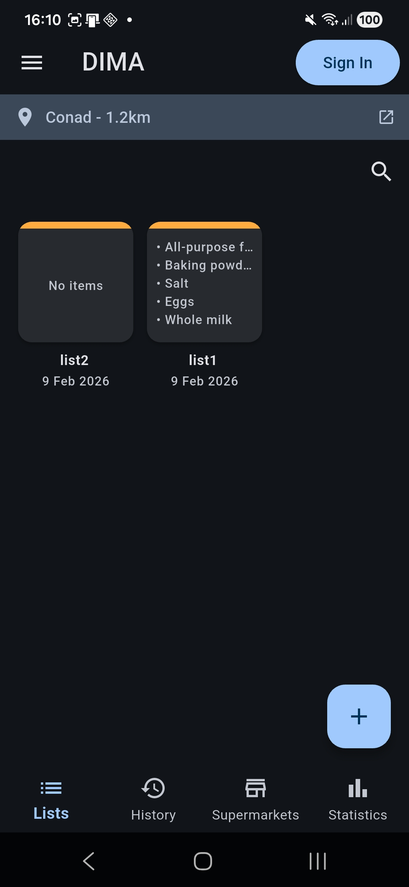
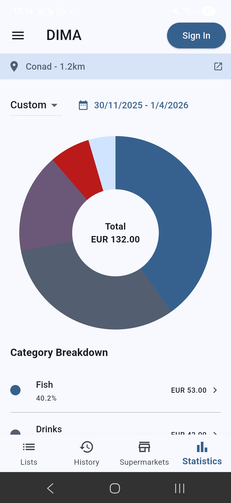
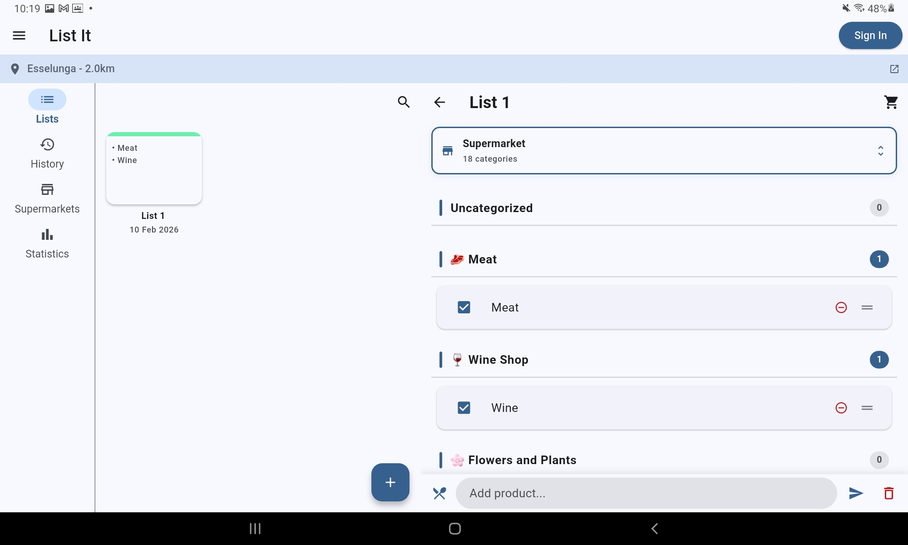
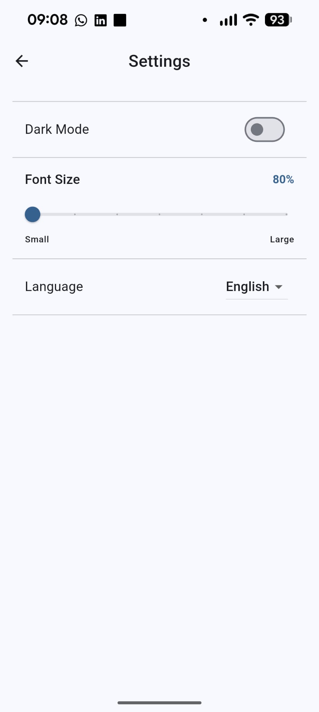
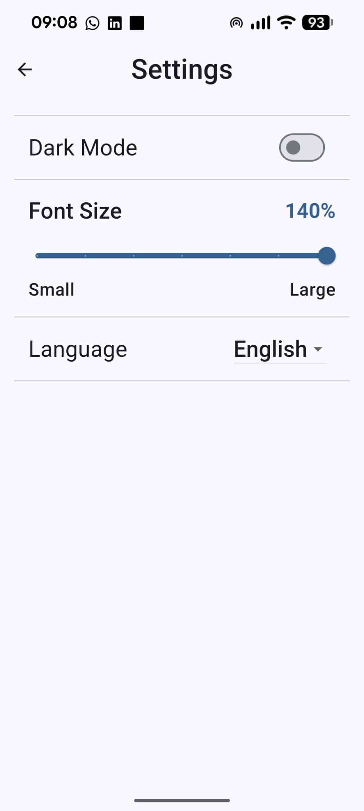

# List It 🛒

**List It** is a smart, offline-first grocery shopping assistant designed to make the shopping process efficient and insightful. Built with **Flutter**, it leverages Generative AI and on-device Machine Learning to automate list organization and track spending habits.

<div align="center">
  
  
  [](https://flutter.dev/)
  [](https://dart.dev/)
  [](https://firebase.google.com/?_gl=1*1som8j*_up*MQ..&gclid=CjwKCAiAtLvMBhB_EiwA1u6_Pg4fqRTGb7QH1aNcPyIUfjXRpmRlNDXXJ9n7DhN59HPhoy2GkEMRZRoCjL0QAvD_BwE&gclsrc=aw.ds)
  [](https://sqlite.org/)
  [](https://riverpod.dev/)
</div>

> **Course:** Design and Implementation of Mobile Applications (DIMA)  
> **Institution:** Politecnico di Milano  
> **Academic Year:** 2025-2026  
> **Professor:** Luciano Baresi

---

## 📋 Overview

Grocery shopping is often inefficient due to disorganized lists and difficult expense tracking. **List It** solves these problems by:
1.  **Automating Organization:** Automatically categorizing products to match supermarket aisles using AI.
2.  **Tracking Expenses:** extracting prices from receipts via OCR and AI to provide detailed spending statistics.

## ✨ Key Features

### 🧠 AI-Powered Intelligence
-   **Smart Categorization:** Uses **Google Gemini Flash 2.5** to automatically assign categories to products (e.g., "Apples" → "Fruit & Veg").
-   **Recipe Import:** Generate shopping lists from recipe names using GenAI.
-   **Receipt Scanning:** Snap a photo of your receipt; the app uses **Google ML Kit (OCR)** and Gemini to match prices and quantities to your list items automatically.

### 📍 Location & Context
-   **Supermarket Awareness:** Retrieves the nearest supermarkets using **OpenStreetMap (Overpass API)**.

### 📊 Data & Sync
-   **Offline-First:** Works entirely without an internet connection using a local SQLite database.
-   **Multi-Device Sync:** Custom synchronization engine (Push/Pull) with **Firestore** for seamless cross-device usage.
-   **Statistics:** Aggregated expense charts by time period and category.

### 📱 User Experience
-   **Cross-Platform:** Android 5+ & iOS 3+, iPadOS 13+.
-   **Adaptive UI:** Optimized layouts for both **Smartphones** and **Tablets** (Master-Detail view).
-   **Accessibility:** Dark Mode, Font Size Scaling, and Localization (English/Italian).

## 🛠️ Architecture & Tech Stack

The application follows a clean, **Layered Architecture** to ensure separation of concerns, scalability, and testability.

### 🏗️ Architecture Design

The app's logic is divided into three distinct layers, facilitating a unidirectional data flow and easy mocking for tests.

**1. Presentation Layer (UI)**
*   **Widgets & Screens:** Responsible only for rendering the UI and listening to user input.
*   **Responsiveness:** Adapts layout strategies based on device type (Mobile vs Tablet).

**2. Application Layer (State Management)**
*   **Riverpod Providers & Notifiers:** Acts as the bridge between the UI and the Data layer. It holds the transient state, handles business logic (like counting total prices), and triggers side effects.

**3. Data Layer (Repositories & Sources)**
*   **Repository Pattern:** This pattern decouples the business logic from the data sources. The app uses **Abstract Repositories** to define contracts, with two concrete implementations:
    *   **Real Repositories:** Interact with SQLite, Firebase, and APIs.
    *   **Mock Repositories:** In-memory implementations used strictly for testing.
*   **Offline-First Sync Engine:** A custom mechanism that intercepts data writes. It saves data immediately to **SQLite** and queues the operation in a local `sync_box`. A background process then pushes these changes to **Firestore** periodically when online, resolving conflicts via a "Last Write Wins" strategy.

### 💻 Tech Stack

#### 🎨 Frontend
*   **Framework:** Flutter (Dart)
*   **State Management:** [Riverpod](https://riverpod.dev/) (AsyncNotifier/Provider)
*   **Localization:** `flutter_localizations` & `intl` (ARB files)

#### ☁️ Backend & Data
*   **Cloud Backend:** Firebase (Firestore, Auth)
*   **Local Database:** [sqflite](https://pub.dev/packages/sqflite) (SQLite)

#### 🤖 AI & External Services
*   **Generative AI:** [Google Generative AI](https://pub.dev/packages/google_generative_ai) (Gemini Flash 2.5)
*   **Machine Learning:** [Google ML Kit](https://pub.dev/packages/google_mlkit_text_recognition) (On-device OCR)
*   **Maps API:** [Overpass API](https://wiki.openstreetmap.org/wiki/Overpass_API) (OpenStreetMap data)

#### 📱 Device Services (Drivers/Plugins)
*   **Camera:** `camera` package for capturing receipts.
*   **Location:** `geolocator` for GPS coordinates.
*   **Connectivity:** `connectivity_plus` to monitor network status for sync.
*   **Linking:** `url_launcher` to open external map applications.

#### 📚 Key Libraries
*   **Testing:** `flutter_test`, `mocktail`, `integration_test`.
*   **Utilities:** `logger` (debugging), `uuid` (unique IDs), `shared_preferences` (settings).
*   **UI Components:** `flutter_staggered_grid_view`.

#### Database Schema
The application primarily uses **SQLite** for local storage, which mirrors the structure in **Firebase Firestore**.

| Entity | Description |
| :--- | :--- |
| **ShoppingList** | Represents a user's shopping list. Stores name, creation date, registered status, and trash status. |
| **Product** | The global catalog of items. Stores the name and visibility status. |
| **PurchasedProduct** | The central entity linking a `ShoppingList` to a `Product`. Stores specific instance data like **quantity**, **price**, and **category**. |
| **Category** | Represents supermarket aisles (e.g., Dairy, Bakery). Contains name and localized labels. |
| **Supermarket** | Stores user-created or downloaded supermarkets. Contains name, favorite status, and ordered list of categories. |
| **Associations** | A mapping table that learns where specific products are located within specific supermarkets to automate categorization. |
| **RecipeCache** | Caches AI-generated recipes to improve performance and reduce API calls. |
| **SyncBox** | A queue table storing local changes (Upserts/Deletes) waiting to be pushed to the cloud. |

Report to the Design Document for further details.


## 🔧 Project Structure

```text
/lib
├── l10n/          # Multi-language support (English/Italian).
├── models/        # Core data entities (ShoppingList, Product, User, etc.).
├── providers/     # Riverpod state management classes.
├── repositories/  # Abstractions for data access (Mock & Real implementations).
├── screens/       # UI Views and adaptive layouts.
├── services/      # External API clients (Gemini, OCR, Location).
├── styles/        # Theme, color, and style definitions.
├── utils/         # Helper functions and utilities.
├── widgets/       # Reusable UI components and custom widgets.
└── main.dart      # Application entry point.
```

## 📱 Screenshots

<div align="center">

<h3 align="center">Main Home Screens</h3>

  <table align="center">
    <tr>
      <td align="center">
        <h4>Lists Tab - Dark Themed</h4>
        
      </td>
      <td align="center">
        <h4>History Tab - Light Themed</h4>
        
      </td>
      <td align="center">
        <h4>Supermarket Tab - Light Themed</h4>
        
      </td>
      <td align="center">
        <h4>Stats Tab - Light Themed</h4>
        
      </td>
    </tr>
  </table>
  
  <h3>Home Tab Tablet View with List Detail Screen</h3>
  

  <h3 align="center">Settings Screen - Font Size Comparison</h3>

  <table align="center">
    <tr>
      <td align="center">
        <h4>Small Font Size</h4>
        
      </td>
      <td align="center">
        <h4>Large Font Size</h4>
        
      </td>
    </tr>
  </table>
</div>

### Showcased Features 

- **Lists Home Tab**: Interface for the creation of new shopping lists.
- **History Tab**: Interface to access registered shopping lists.
- **Supermarkets Tab**: Interface to create/edit/delete and manage supermarkets and their categroies.
- **Statistics Tab**: Intuitive interface for the management and analysis of historical expenses through time.
- **Theme Support**: Both light and dark modes are available.
- **List Edit Screen**: The tablet view shows the interface to add and automatically categorize products in a list. The list edit screen preserves its layout on both mobile and tablet devices.
- **Font Size Adaptation**: The app can be adapted to the user preferences and needs by enlarging or shrinking the font size.

## 🔐 Security & Privacy

- **Authentication**: Supports Anonymous login, Email/Password, and Google Sign-In via Firebase Auth.
- **Verification**: Users signing up are requestd to verify their emails through a link sent to their inboxes.
- **Credential Recovery**: Users can recover their forgotten passwords through a recovery link.
- **Data Privacy**: Anonymous users keep data locally until account linking. Receipt processing happens on-device (OCR) before secure AI processing.

## 📊 AI Integration Details

| Feature | AI Model | Description |
| :--- | :--- | :--- |
| **Product Categorization** | Gemini 2.5 Flash | Assigns category (e.g., "Dairy") based on product name. |
| **Recipe Generation** | Gemini 2.5 Flash | Generates ingredient lists and quantities from a recipe name. |
| **Receipt Scanning** | ML Kit + Gemini | ML Kit extracts text; Gemini parses the unstructured text into JSON (Product, Price, Quantity). |

## 🌐 Internationalization

The application supports multiple languages through Flutter's internationalization system:

- English (default)
- Italian
- Additional languages can be added via ARB files

## 🧪 Testing

The project maintains a high standard of quality assurance with approximately **70% code coverage**. 
The uncovered percentages are due to: complex widgets/animations, rare branches, interaction with external services and platform specific, generated and boilerplpate code. 

Testing is mainly performed by the `flutter_test` library. 
Testing environemets were dsigned by mocking calls to Local/Remote Services for dependency isolation. Mocked interactions were designed by the usage of custom mocked classes and the `mocktail` library.
Integration tests were performed by the usage of the `integration_test` library.

- **Unit Tests**: Validate models, repositories, and the synchronization logic.
- **Widget Tests**: Verify UI components and screen interactions.
- **Integration Tests**: Cover 6 critical user flows:
    1.  Authentication Flow.
    2.  List Registration & Persistence.
    3.  Category Management.
    4.  Supermarket Management.
    5.  Statistics Updates.
    6.  Category Persistence.
 - **User Tests**: A user was given the possibility to test the application for 48h. Afterwars, th user was submitted a structured questioneer to return feedback. The user's answers are reported in the Design Document. The feedback positive.

## 🚀 Getting Started

### Prerequisites

- **Flutter SDK** 3.22.0 or higher
- **Dart SDK** 3.9.2 or higher
- **Google Gemini API Key**
- **Firebase Project Configuration**

### Installation

1.  **Clone the Repository**
    ```bash
    git clone <repository-url>
    cd app_code
    ```

2.  **Install Dependencies**
    ```bash
    flutter pub get
    ```

3.  **Environment Configuration**
    *   Ensure `firebase_options.dart` is present in `lib/` (configured via `flutterfire configure`).
    *   The app requires a Gemini API key passed at compile time.

### Running the Application

To run the app, you must provide the Gemini API key using the `--dart-define` flag:

```bash
flutter run --dart-define=GEMINI_API_KEY=your_actual_api_key_here
```

## 🤝 Contributing

We welcome contributions to improve List It! Please follow these steps:

1.  **Fork the repository**
2.  **Create a feature/chore/fix branch** (`e.g. git checkout -b feature/x`)
3.  **Commit your changes** (`e.g. git commit -m 'Commit message'`)
4.  **Push to the branch** (`e.g. git push origin feature/x`)
5.  **Open a Pull Request** to merge changes in main branch.

### Development Guidelines

-   **Style**: Follow standard [Flutter/Dart style guidelines](https://dart.dev/guides/language/effective-dart/style).
-   **Architecture**: Maintain the Repository Pattern. UI logic should stay in Controllers/Notifiers, not in the Widget tree.
-   **Testing**: New features must include Unit and Widget tests. Ensure existing tests pass before submitting a PR.
-   **Localization**: All user-facing strings must be added to the ARB files in `lib/l10n/` to support internationalization.

## 👥 Authors

- **Leonardo Ratti** - [GitHub](https://github.com/LRatti)
- **Mattia Peruzzi** - [GitHub](https://github.com/MattiaPeru)

## 📄 License

This project is licensed under the MIT License - see the [LICENSE](LICENSE) file for details.

--- 

<div align="center">
  <p>List It, A Flutter App.</p>
</div>


